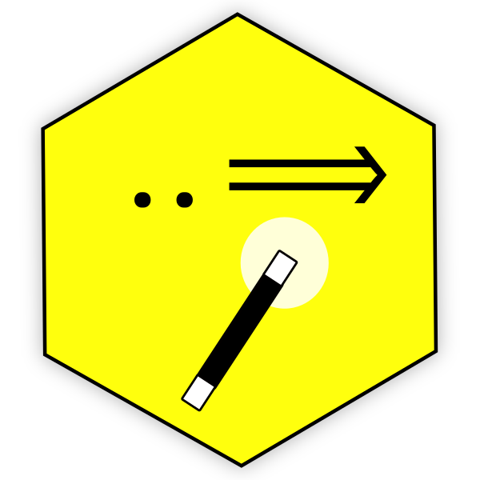
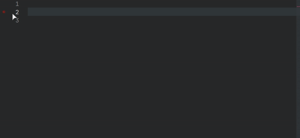

<h1 align="center">
  <br>
    
  <br>
	<br>
  Humane JavaScript Snippets
  <br>
  <br>
</h1>
<h4 align="center">Descriptive, easy to find JavaScript snippets, without nonsense abbreviations.</h4>
<br/>
<p align="center">


<a href="https://ko-fi.com/roboleary"></a>
</p>

Most snippet collections resemble bash aliases. You have a list of nonsense abbreviations such as: "imp", "clg", "fre". You must learn these to use them. 🤕

There is a better way!

Snippets are not confined to using a single word as the trigger (prefix), and quick suggestions offered by VS Code are produced from a fuzzy substring search on the prefixes. This means we can use spaces in prefixes, and add more descriptive prefixes to make our snippets easier to discover.

For example, you want to find an array function, but you're not sure which to use. Just type "arr" and you get a list of array functions with descriptions:



In future, you know you want to use the `filter` function, just type "filt" or some variation, and you will get that as the first suggestion. 🔥

## Activation

These snippets are available for the follow [language identifiers](https://code.visualstudio.com/docs/languages/identifiers):
- `javascript`
- `javascriptreact`
- `typescript`
- `vue`
- `svelte`

## Snippets

You can install the [Snippets Ranger extension](https://marketplace.visualstudio.com/items?itemName=robole.snippets-ranger) to view the full list of snippets inside VS Code.

I didn't repeat any of the builtin JavaScript snippets (see [FAQ for more](#where-do-the-standard-markdown-snippets-come-from)).

<table data-path="/home/rob/programming/workspace/js/VS Code/vscode-javascript-snippets/snippets/snippets.code-snippets">
<thead><tr><th>Prefix</th><th>Name</th><th>Description</th><th>Body</th><th>Action</th></tr></thead>
<tbody><tr>
<td>array concat</td>
<td>Array.prototype.concat</td>
<td>Joins two or more arrays, and returns a copy of the joined arrays</td><td><code>let ${1:newArray} = ${2:array1}.concat(${3:array2})<br>$0<br></code></td>

</tr><tr>
<td>array copyWithin</td>
<td>Array.prototype.copyWithin</td>
<td>Copies array elements within the array, to and from specified positions. Syntax: array.copyWithin(target, start, end).</td><td><code>${1:array}.copyWithin(${1:target}, ${2:start}, ${3:end});<br>$0<br></code></td>

</tr><tr>
<td>array every</td>
<td>Array.prototype.every</td>
<td>Checks if every element in an array pass a test.</td><td><code>let ${1:boolean} = ${2:array}.every((${3:item}) =&gt; {<br> return $4<br>}<br>$0<br></code></td>

</tr><tr>
<td>array fill</td>
<td>Array.prototype.fill</td>
<td>Fill the elements in an array with a static value.</td><td><code>${1:array}.fill(${1:target}, ${2:start}, ${3:end});<br>$0<br></code></td>

</tr><tr>
<td>array filter</td>
<td>Array.prototype.filter</td>
<td>Creates a new array with every element in an array that pass a test</td><td><code>let ${1:newArray} = ${2:array}.filter((${3:item}) =&gt; {<br> return $4<br>}<br>$0<br></code></td>

</tr><tr>
<td>array find</td>
<td>Array.prototype.find</td>
<td>Returns the value of the first element in an array that pass a test.</td><td><code>let ${1:result} = ${2:array}.find((${3:item}) =&gt; {<br> return $4<br>}<br>$0<br></code></td>

</tr><tr>
<td>array findIndex</td>
<td>Array.prototype.findIndex</td>
<td>Returns the index of the first element in an array that pass a test</td><td><code>let ${1:result} = ${2:array}.findIndex((${3:item}) =&gt; {<br> return $4<br>}<br>$0<br></code></td>

</tr><tr>
<td>array includes</td>
<td>Array.prototype.includes</td>
<td>Check if an array contains the specified element. It is case sensitive.</td><td><code>let ${1:boolean} = ${2:array}.includes(${3:element}, ${4:start})<br>$0<br></code></td>

</tr><tr>
<td>array indexOf</td>
<td>Array.prototype.indexOf</td>
<td>Search the array for an element and return its position.</td><td><code>let ${1:index} = ${2:array}.indexOf(${3:item}, ${4:start})<br>$0<br></code></td>

</tr><tr>
<td>array map</td>
<td>Array.prototype.map</td>
<td>Creates a new array populated with the results of calling the provided function on every element in the array.</td><td><code>let ${1:newArray} = ${2:array}.map((${3:item}) =&gt; {<br> return $4<br>}<br>$0<br></code></td>

</tr><tr>
<td>array push</td>
<td>Array.prototype.push</td>
<td>Add new items to the end of an array.</td><td><code>${1:array}.push((${2:items});<br>$0<br></code></td>

</tr><tr>
<td>array reduce</td>
<td>Array.prototype.reduce</td>
<td>Reduce the values of an array to a single value (going left-to-right).</td><td><code>let ${1:newArray} = ${2:array}.reduce((accumulator, currentValue) =&gt; {<br> return $4<br>}<br>$0<br></code></td>

</tr><tr>
<td>array reduceRight</td>
<td>Array.prototype.reduceRight</td>
<td>Reduce the values of an array to a single value (going left-to-right).</td><td><code>let ${1:newArray} = ${2:array}.reduceRight((accumulator, currentValue) =&gt; {<br> return $4<br>}<br>$0<br></code></td>

</tr><tr>
<td>array slice</td>
<td>Array.prototype.slice</td>
<td>Selects a part of an array, and returns the new array.</td><td><code>let ${1:newArray} = ${2:array}.slice(${3:start}, ${4:end});<br>${0}<br></code></td>

</tr><tr>
<td>array some</td>
<td>Array.prototype.some</td>
<td>Checks if any of the elements in an array pass a test.</td><td><code>let ${1:result} = ${2:array}.some((${3:item}) =&gt; {<br> return $4<br>}<br>${0}<br></code></td>

</tr><tr>
<td>array splice</td>
<td>Array.prototype.splice</td>
<td>Adds/Removes elements from an array.</td><td><code>${1:array}.splice(${3:index}, ${4:howManyToRemove}, ${5:newItems});<br>${0}<br></code></td>

</tr><tr>
<td>array unshift</td>
<td>Array.prototype.unshift</td>
<td>Adds new elements to the beginning of an array, and returns the new length.</td><td><code>${1:array}.unshift(${3:items});<br>${0}<br></code></td>

</tr><tr>
<td>destructure array</td>
<td>Array destructuring</td>
<td>Assign values from array elements to new variables using destructuring.</td><td><code>const [${1:variables}] = ${2:arrayName};<br>$0<br></code></td>

</tr><tr>
<td>async function</td>
<td>async function</td>
<td>Create an async function. Async functions can contain zero or more await expressions.</td><td><code>async function ${1:name}(${2:parameters}){<br> $3<br>}<br>$0<br></code></td>

</tr><tr>
<td>arrow function,=&gt;</td>
<td>arrow function</td>
<td>Creates an arrow function with optional parameters.</td><td><code>(${1:parameters}) =&gt; {<br> $2<br>}<br>$0<br></code></td>

</tr><tr>
<td>prototype function</td>
<td>prototype function</td>
<td>Creates an prototype function with optional parameters.</td><td><code>${1:object}.prototype.${2:name} = function(${3:parameters}) {<br> $4<br>}<br>$0<br></code></td>

</tr><tr>
<td>iife</td>
<td>Immediately Invoked Function Expression (IIFE)</td>
<td>An IIFE (Immediately Invoked Function Expression) is a JavaScript function that runs as soon as it is defined. It creates it's own local scope.</td><td><code>(function () {<br> $1<br>})();<br>$0<br></code></td>

</tr><tr>
<td>destructure object</td>
<td>Object destructuring</td>
<td>Assign values from object to new variables using destructuring.</td><td><code>const {${1:variables}} = ${2:objectName};<br>$0<br></code></td>

</tr></tbody></table>

## Installation

1. The extension is listed in the [VS Code Marketplace](https://marketplace.visualstudio.com/items?itemName=robole.javascript-snippets) and [Open VSX Marketplace](https://open-vsx.org/extension/robole/markdown-snippets) where you can download or install it directly.
1. From the Command-line: Run the command `code --install-extension robole.javascript-snippets`.

## FAQ

### 1) Where are the builtin JavaScripts?

There is a set of snippets for the JavaScript installed with VS Code as part of the built-in JavaScript extension. [This is the source file](https://raw.githubusercontent.com/microsoft/vscode/94c9ea46838a9a619aeafb7e8afd1170c967bb55/extensions/javascript/snippets/javascript.code-snippets).

You can see these inside VS Code by:
1. By opening a JavaScript file and running the commmand `Insert Snippet`, which gives a list of the snippets in the dropdown. However, this list also contains any user and extension snippets for JavaScript. Option 2 is preferable if you want to see a clear overview of the separate snippet sets.
1. The [Snippets Ranger extension](https://marketplace.visualstudio.com/items?itemName=robole.snippets-ranger) will show you the built-in snippets in a good-looking webview inside VS Code.

### 2) How can I get see snippets to be offered at the top of the quick suggetion list?

Snippets are mixed in with other suggestions, and by default they are placed towards the end of the list. To promote suggestions to the top of the list, you can set `editor.snippetSuggestions": "top"` in your `settings.json`.

### 3) How do I use the snippets?

To insert a snippet, you can just type one of the prefixes in a markdown file, and you will be offered a completion suggestion. The setting `Editor: Snippet Suggestions` controls whether snippets are shown with other suggestions and how they are sorted. By default, they are shown inline.

Alternatively, you can open the Command Palette (`Ctrl+Shift+P`) and run the command "Insert Snippet", which presents you with a list to choose from.

### 4) How do I add shortcuts for the snippets?

Run the command `Preferences: Open Settings (UI)` to open the keyboard shortcuts config. Add an new object to the array such as this:

```JSON
[

	{
		"key": "ctrl+t",
		"mac": "cmd+t",
		"command": "editor.action.insertSnippet",
		"when": "!editorReadonly && editorLangId == javascript",
		"args": {
			"langId": "javascript",
			"name": "arrow function"
		}
	}
]
```

The `args.name` property <u>must exactly match</u> the snippet name.

### 5) Where can I learn more about snippets?

You can read my comprehensive guide on Snippets on FreeCodeCamp: [Visual Studio Code Snippets – the Definitive VS Code Snippet Guide for Beginners](https://www.freecodecamp.org/news/definitive-guide-to-snippets-visual-studio-code/). It's not just for beginners! 😉

## Show gratitude

If you are happy with the extension, please star the repo, and leave a review to help others find it. 🌟🌟🌟🌟🌟

You can [buy me a coffee](https://ko-fi.com/roboleary) if you would like to enable me to make more great open-source software and tutorials. ☕🙏

[](https://ko-fi.com/roboleary)

## Image Attribution

Logo inspired by [Brain by Nithinan Tatah from the Noun Project](https://thenounproject.com/search/?q=brain&i=2452319).
